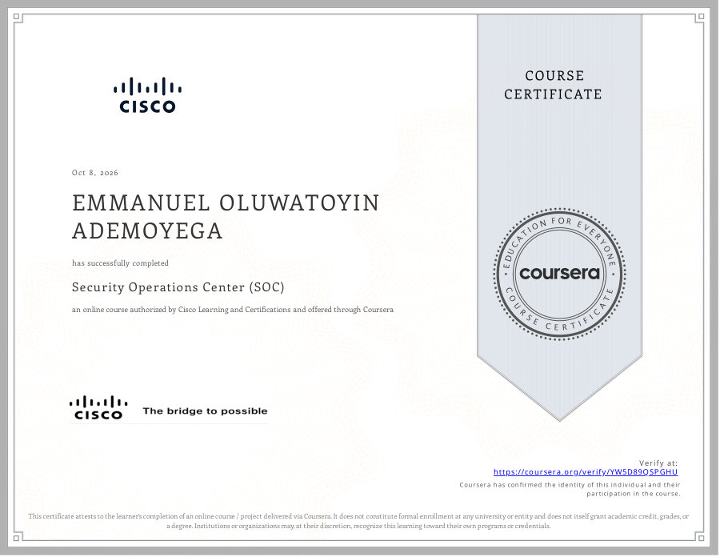
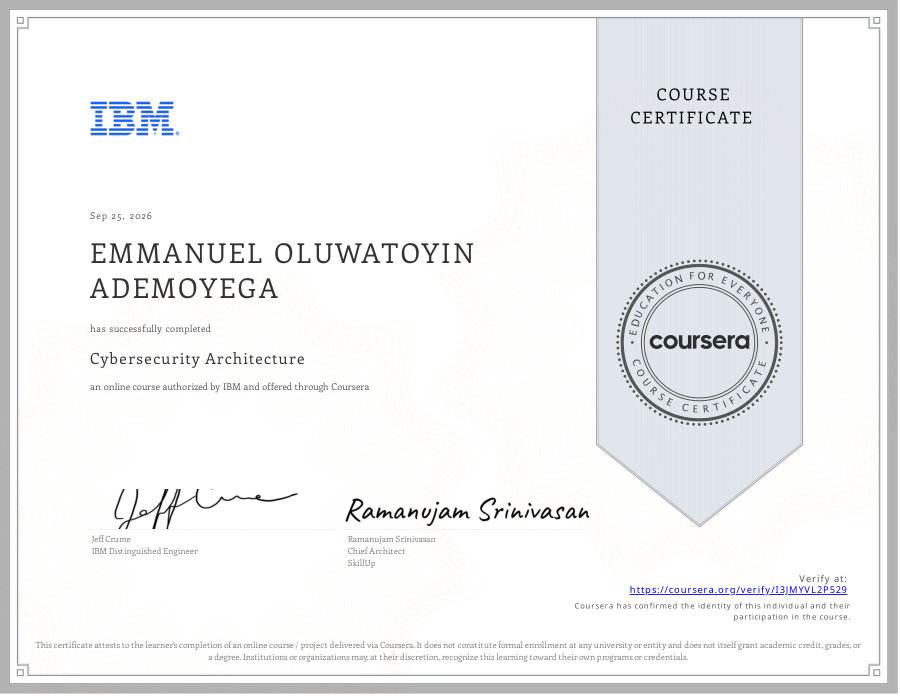
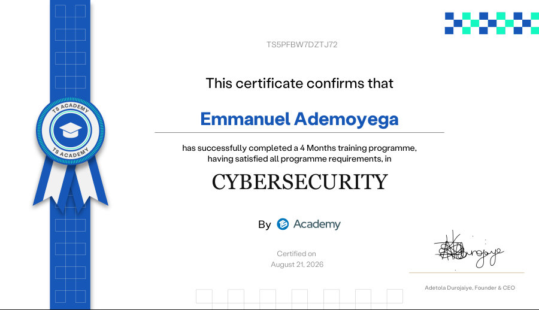
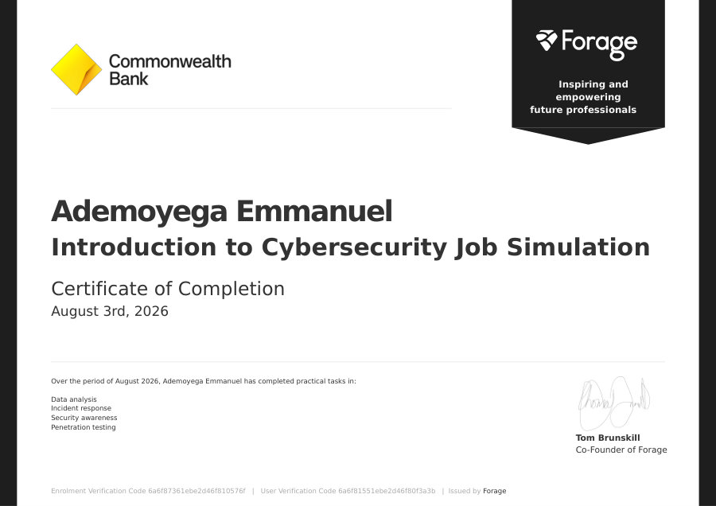
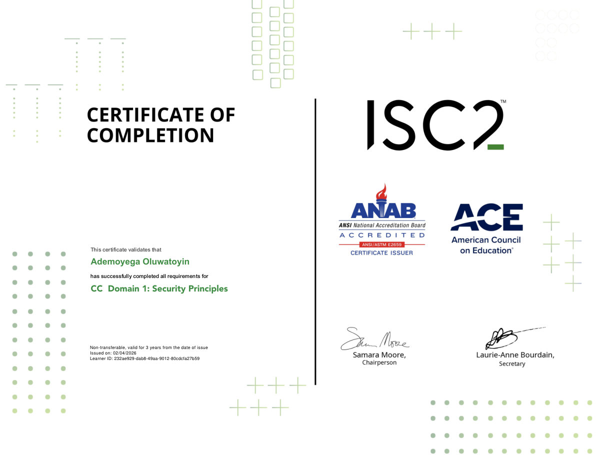
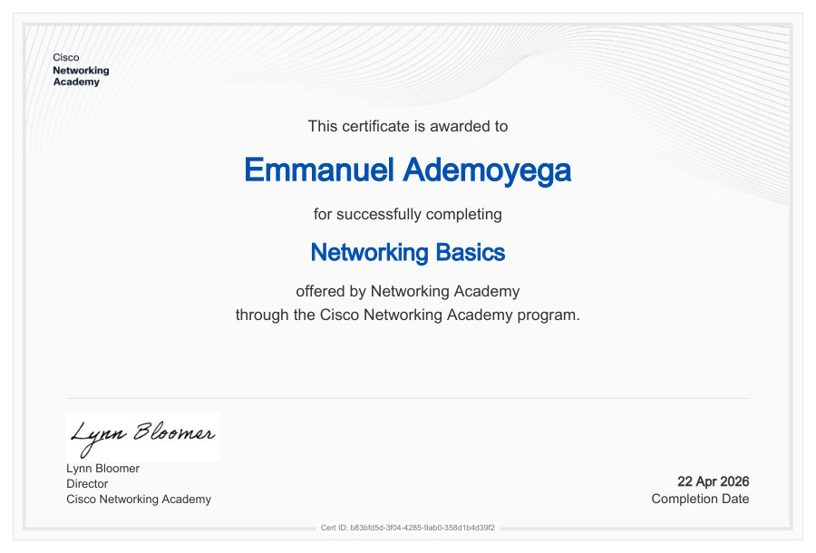
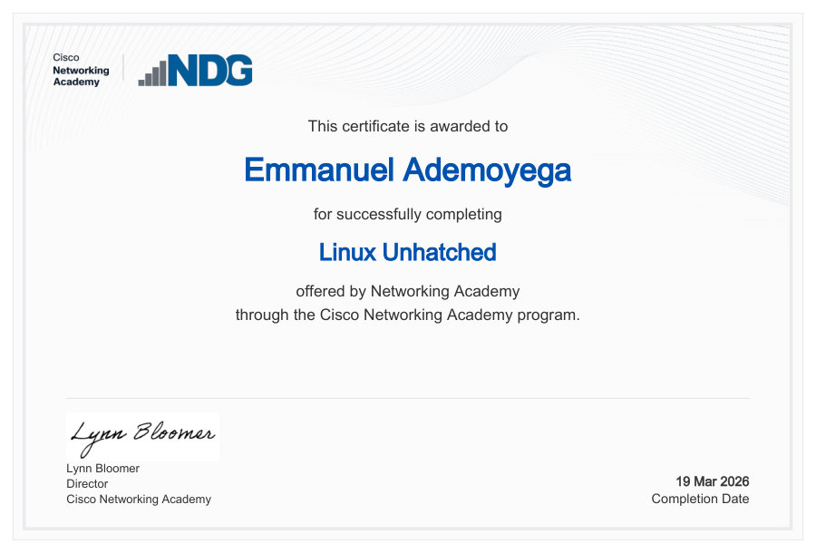
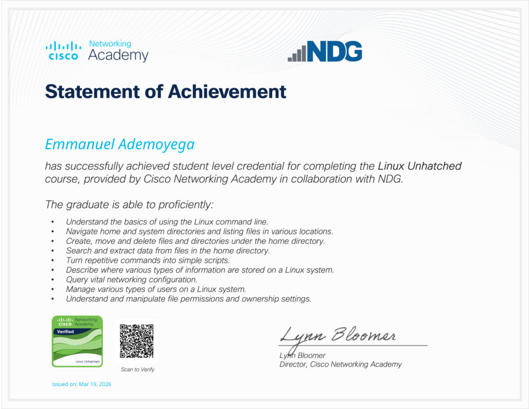

# Cybersecurity Certification Portfolio

Professional certificates and course credentials in **cybersecurity**, **networking** and **Linux**, earned in 2026 by **Emmanuel Oluwatoyin Ademoyega**. Each certificate is stored as a PDF in this repository, previewed below, and listed with its issuer and verification route.

## At a glance

| Item | Details |
|---|---|
| **Holder** | Emmanuel Oluwatoyin Ademoyega ([@Toyin-elankey](https://github.com/Toyin-elankey)) |
| **Certificates** | 8 documents covering 7 courses and programs |
| **Categories** | Cybersecurity (5) · Networking (1) · Linux (2) |
| **Issuers** | ISC2 · Forage with Commonwealth Bank · TS Academy · Coursera (authorized by IBM and by Cisco) · Cisco Networking Academy |
| **Period** | February 2026 – October 2026 |

## Contents

- [Certification summary](#certification-summary)
- [Certifications by category](#certifications-by-category)
- [Skills and competencies](#skills-and-competencies)
- [Repository structure](#repository-structure)
- [Disclaimer](#disclaimer)

## Certification summary

Listed newest first. Each title links to its certificate PDF.

| # | Certification | Issuer | Category | Date | Verification |
|:-:|---|---|:-:|---|---|
| 1 | [Security Operations Center (SOC)](certificates/cybersecurity/Coursera_Security-Operations-Center-SOC-Cisco.pdf) | Coursera (authorized by Cisco) | Cybersecurity | 8 Oct 2026 | [coursera.org/verify/YW5D89QSPGHU](https://coursera.org/verify/YW5D89QSPGHU) |
| 2 | [Cybersecurity Architecture](certificates/cybersecurity/Coursera_Cybersecurity-Architecture-IBM.pdf) | Coursera (authorized by IBM) | Cybersecurity | 25 Sep 2026 | [coursera.org/verify/I3JMYVL2P529](https://coursera.org/verify/I3JMYVL2P529) |
| 3 | [Cybersecurity Training Programme (4 Months)](certificates/cybersecurity/TS-Academy_Cybersecurity-Training-Programme.pdf) | TS Academy | Cybersecurity | 21 Aug 2026 | Certificate ID `TS5PFBW7DZTJ72` |
| 4 | [Introduction to Cybersecurity Job Simulation](certificates/cybersecurity/Forage_Introduction-to-Cybersecurity-Job-Simulation.pdf) | Forage, with Commonwealth Bank | Cybersecurity | 3 Aug 2026 | Verification codes on certificate |
| 5 | [Networking Basics](certificates/networking/Cisco_Networking-Basics.pdf) | Cisco Networking Academy | Networking | 22 Apr 2026 | Certificate ID `b83bfd5d-3f04-4285-9ab0-358d1b4d39f2` |
| 6 | [Linux Unhatched: Certificate of Completion](certificates/linux/Cisco_Linux-Unhatched_Certificate-of-Completion.pdf) | Cisco Networking Academy | Linux | 19 Mar 2026 | None printed |
| 7 | [Linux Unhatched: Statement of Achievement](certificates/linux/Cisco_Linux-Unhatched_Statement-of-Achievement.pdf) | Cisco Networking Academy, with NDG | Linux | 19 Mar 2026 | [Credly badge](https://www.credly.com/badges/7e2fe503-9629-477c-a268-94364fdd527b) |
| 8 | [Certified in Cybersecurity (CC): Domain 1, Security Principles](certificates/cybersecurity/ISC2_Certified-in-Cybersecurity-Domain-1-Security-Principles.pdf) | ISC2 | Cybersecurity | 4 Feb 2026 | Learner ID on certificate |

Coursera certificates can be verified at the links above. The QR code on the Cisco Statement of Achievement points to its Credly badge.

## Certifications by category

Each card links to the certificate PDF and, where one exists, to the issuer's verification page.

### Cybersecurity (5)

<table>
  <tr>
    <td align="center" valign="top" width="50%">
      <a href="certificates/cybersecurity/Coursera_Security-Operations-Center-SOC-Cisco.pdf"></a>
      <br><strong>Security Operations Center (SOC)</strong>
      <br>Coursera · 8 Oct 2026
      <br>Online course authorized by Cisco Learning and Certifications and delivered through Coursera.
      <br><a href="certificates/cybersecurity/Coursera_Security-Operations-Center-SOC-Cisco.pdf">View PDF</a> · <a href="https://coursera.org/verify/YW5D89QSPGHU">Verify</a>
    </td>
    <td align="center" valign="top" width="50%">
      <a href="certificates/cybersecurity/Coursera_Cybersecurity-Architecture-IBM.pdf"></a>
      <br><strong>Cybersecurity Architecture</strong>
      <br>Coursera · 25 Sep 2026
      <br>Online course authorized by IBM and delivered through Coursera.
      <br><a href="certificates/cybersecurity/Coursera_Cybersecurity-Architecture-IBM.pdf">View PDF</a> · <a href="https://coursera.org/verify/I3JMYVL2P529">Verify</a>
    </td>
  </tr>
  <tr>
    <td align="center" valign="top" width="50%">
      <a href="certificates/cybersecurity/TS-Academy_Cybersecurity-Training-Programme.pdf"></a>
      <br><strong>Cybersecurity Training Programme (4 Months)</strong>
      <br>TS Academy · 21 Aug 2026
      <br>Completed a four-month cybersecurity training programme, satisfying all programme requirements.
      <br><a href="certificates/cybersecurity/TS-Academy_Cybersecurity-Training-Programme.pdf">View PDF</a> · Certificate ID <code>TS5PFBW7DZTJ72</code>
    </td>
    <td align="center" valign="top" width="50%">
      <a href="certificates/cybersecurity/Forage_Introduction-to-Cybersecurity-Job-Simulation.pdf"></a>
      <br><strong>Introduction to Cybersecurity Job Simulation</strong>
      <br>Forage, with Commonwealth Bank · 3 Aug 2026
      <br>Completed practical tasks in data analysis, incident response, security awareness and penetration testing.
      <br><a href="certificates/cybersecurity/Forage_Introduction-to-Cybersecurity-Job-Simulation.pdf">View PDF</a> · Verification codes on certificate
    </td>
  </tr>
  <tr>
    <td align="center" valign="top" width="50%">
      <a href="certificates/cybersecurity/ISC2_Certified-in-Cybersecurity-Domain-1-Security-Principles.pdf"></a>
      <br><strong>Certified in Cybersecurity (CC): Domain 1, Security Principles</strong>
      <br>ISC2 · 4 Feb 2026
      <br>Completed all requirements for Domain 1 of the ISC2 Certified in Cybersecurity program. Non-transferable and valid for three years from the date of issue.
      <br><a href="certificates/cybersecurity/ISC2_Certified-in-Cybersecurity-Domain-1-Security-Principles.pdf">View PDF</a> · Learner ID on certificate
    </td>
    <td></td>
  </tr>
</table>

### Networking (1)

<table>
  <tr>
    <td align="center" valign="top" width="50%">
      <a href="certificates/networking/Cisco_Networking-Basics.pdf"></a>
      <br><strong>Networking Basics</strong>
      <br>Cisco Networking Academy · 22 Apr 2026
      <br>Completed the Networking Basics course through the Cisco Networking Academy program.
      <br><a href="certificates/networking/Cisco_Networking-Basics.pdf">View PDF</a> · Certificate ID <code>b83bfd5d-3f04-4285-9ab0-358d1b4d39f2</code>
    </td>
    <td></td>
  </tr>
</table>

### Linux (2)

<table>
  <tr>
    <td align="center" valign="top" width="50%">
      <a href="certificates/linux/Cisco_Linux-Unhatched_Certificate-of-Completion.pdf"></a>
      <br><strong>Linux Unhatched: Certificate of Completion</strong>
      <br>Cisco Networking Academy · 19 Mar 2026
      <br>Completed the Linux Unhatched course through the Cisco Networking Academy program.
      <br><a href="certificates/linux/Cisco_Linux-Unhatched_Certificate-of-Completion.pdf">View PDF</a>
    </td>
    <td align="center" valign="top" width="50%">
      <a href="certificates/linux/Cisco_Linux-Unhatched_Statement-of-Achievement.pdf"></a>
      <br><strong>Linux Unhatched: Statement of Achievement</strong>
      <br>Cisco Networking Academy, with NDG · 19 Mar 2026
      <br>Student-level credential listing nine Linux competencies, with a verifiable Credly badge.
      <br><a href="certificates/linux/Cisco_Linux-Unhatched_Statement-of-Achievement.pdf">View PDF</a> · <a href="https://www.credly.com/badges/7e2fe503-9629-477c-a268-94364fdd527b">Verify</a>
    </td>
  </tr>
</table>

## Skills and competencies

| Area | Evidence |
|---|---|
| Security principles | ISC2 Certified in Cybersecurity, Domain 1 (Security Principles) |
| Security architecture | Cybersecurity Architecture (IBM, via Coursera) |
| Security operations | Security Operations Center (Cisco, via Coursera) |
| Applied cybersecurity | Data analysis, incident response, security awareness and penetration testing (Forage job simulation); four-month cybersecurity training (TS Academy) |
| Networking | Networking basics (Cisco Networking Academy) |
| Linux | Command-line basics; navigating directories and listing files; creating, moving and deleting files and directories; searching and extracting data; turning repetitive commands into simple scripts; knowing where system information is stored; querying networking configuration; managing users; managing file permissions and ownership (Linux Unhatched) |

## Repository structure

```text
CERTIFICATION-/
├── README.md                  # This document
├── assets/
│   └── previews/              # Preview images used in this README
└── certificates/
    ├── cybersecurity/         # ISC2, Forage, TS Academy, Coursera (IBM and Cisco courses)
    ├── networking/            # Cisco Networking Academy
    └── linux/                 # Cisco Networking Academy (Linux Unhatched)
```

### Adding a certificate

1. Save the PDF in the matching folder under `certificates/` using the `Issuer_Certificate-Name.pdf` pattern.
2. Add a preview image to `assets/previews/`.
3. Add a row to the summary table and a card to the matching category section.

## Disclaimer

Certificates are reproduced for portfolio and verification purposes. Names, logos and trademarks belong to their respective owners, including ISC2, Cisco, IBM, Coursera, Forage, Commonwealth Bank, TS Academy and NDG.

---

*Last updated October 2026.*
